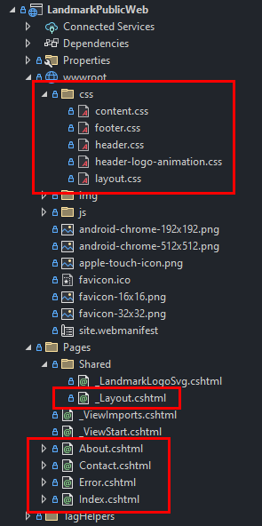

# Getting The Landmark Site Built
This is a TODO list for Chris H. as he builds out the initial Landmark Analytics website!

## Familiarize Yourself
* First, take a look around this application. It's pretty similar to the other .NET applications you've looked at.
* Open the `README.md` file to understand how to run the application in either Visual Studio or VSCode (your choice)
  - I kind of recommend Visual Studio right now since it just works without much effort
  - If you choose VSCode, be sure to read everything there about the extensions and how to start/stop the application
* Open the `/Pages/Shared/_Layout.cshtml` file and read all the comments I added to help explain what things do

## Branches
**As the `README.md` file said, please be sure you are working on a git branch and not on the `main` branch!**
Also, please **DO NOT** merge the `dev` branch into the `main` branch for the same reason!

## Tip: Hot Reload!
Save yourself some time by making sure "Hot Reload" is on!  This is where the website will auto-refresh when you make changes.
* Press that 🔥 (fire/flame) icon near the ▶️ (play/run) button if it's not already on. Be sure the "Hot Reload on File Save" is enabled in the little dropdown menu by this button.
* Remember: the point of this is that you don't have to close the terminal window and rebuild the application every time you make a change. Just minimize that terminal window and switch between Visual Studio and your browser

## Tip: Keyboard!
Try to use your keyboard more than your mouse!
* In Windows Pressing <kbd>Alt</kbd>+<kbd>Tab</kbd> will switch you between your applications. This is much much faster than using your mouse.
  - Add <kbd>Shift</kbd> to that key combo to cycle through the applications in the opposite direction.
* In Chrome pressing <kbd>Ctrl</kbd>+<kbd>Tab</kbd> will switch you between your open tabs in that window.
  - Add <kbd>Shift</kbd> to that key combo to cycle through the tabs in the opposite direction.

## Tip: Word Wrap & Fonts
Sometimes it might make sense to have line wrapping turned on or off.
* In Visual Studio go to the "Edit" menu > "Advanced" > "Word Wrap"
  - Note the key combination too, in case you need to toggle it on/off frequently!
* Make sure your font size is at a good size where you can see a lot of code without it being too small
* Also make sure your zoom is at 100% (bottom left corner of Visual Studio) - I know this was zoomed in for you last time!

------------------------------------------------------------------------------------------------------------------

# Getting Started!
Ok, sorry that was a lot of setup before this!
I just want to make sure we're all on the same page and you can be as efficient as possible.

Take a look at the design I made. It should be in Slack somewhere, if you can't find it I can send you the images.
The goal is to get the basic "frame" of the design in place.
We don't yet know exactly what pages we will have or what will go on them, but the frame around that goes in those pages will be the same no matter what.

Any "static" files, like images and CSS, will be in the `wwwroot` folder.  Look there to find the existing CSS files.

You can use the basic layout that the "coming soon" version of this site has now, or you can scrap it and start from scratch.
The only thing you need to keep the same is the color and shadow of the header, the background image, the logo colors, and the logo animation (which is in a separate CSS file, so just ignore that file)

The "frame" of the site is what the `_Layout.cshtml` file is for.  All the HTML for the "frame" should probably go in there. Just remember that the `@RenderBody()` is where the content of whatever page you visit will be put. You can see that happening as you click the links and see what gets inserted into the page.

# Write some CSS
Keep in mind that to implement this website design you probably only need to write CSS and a little bit of HTML.
You shouldn't need any C# at all, and I doubt you'll need any Razor either.

See the below image. It highlights the only files you should need to focus on. Everything else you probably won't need to touch.

